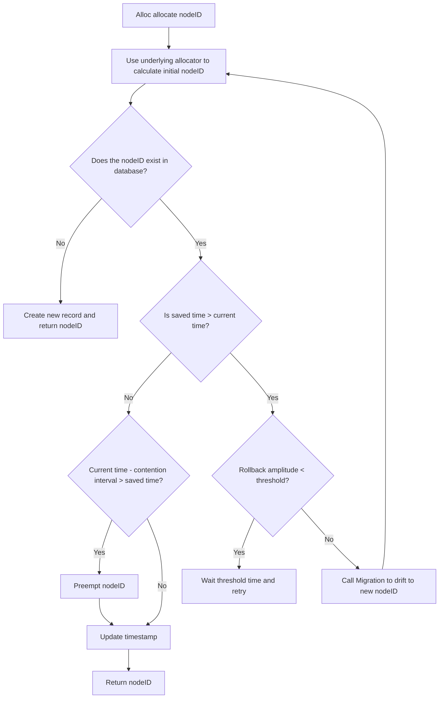
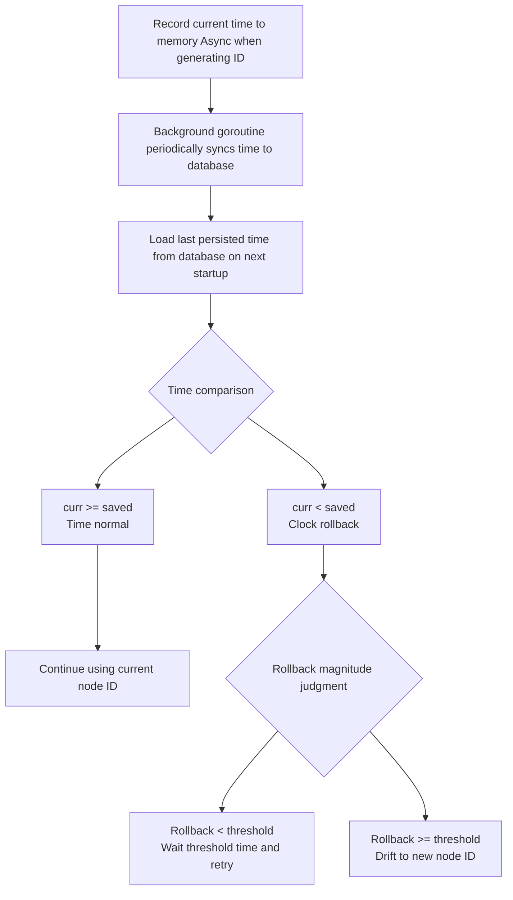

# Snowflake Distributed ID Generator

A distributed unique ID generator based on `bwmarrin/snowflake` with features including database persistence, clock rollback detection, and automatic node ID allocation.

This package primarily solves two problems:

1. Preventing NodeID conflicts
2. Preventing clock rollback

## Features

- **Distributed Unique ID**: Generates 64-bit globally unique IDs based on Twitter's Snowflake algorithm
- **Database Persistence**: Persists node IDs and timestamps to database, supporting container restarts
- **Clock Rollback Detection**: Automatically detects and handles clock rollback issues to prevent ID duplication
- **Automatic Node ID Allocation**: Supports multiple node ID allocation strategies (hash, random)
- **High Performance**: Optimized atomic operations and cache line padding, achieving up to 4.9 million IDs/second
- **Zero Memory Allocation**: No heap memory allocation during ID generation
- **Thread Safe**: Supports concurrent ID generation across multiple goroutines

## Quick Start

### Basic Usage

```go
package main

import (
    "context"
    "time"

    "github.com/GuoxinL/snowflake-gorm"
    nodeidgorm "github.com/GuoxinL/snowflake-gorm/nodeid/gorm"
    "github.com/GuoxinL/snowflake-gorm/nodeid/gorm/model"
    "gorm.io/gorm"
    "gorm.io/driver/mysql"
)

func main() {
    ctx := context.Background()

    // 1. Create database connection
    db, err := gorm.Open(mysql.Open("root:password@tcp(localhost:3306)/db_name"))
    if err != nil {
        panic(err)
    }

    // 2. Initialize table structure
    err = db.AutoMigrate(&model.SnowflakeKv{})
    if err != nil {
        panic(err)
    }

    // 3. Create Snowflake instance
    sf, err := snowflake.NewSnowflake(
        ctx,
        db,                        // Database connection
        "snowflake",               // Service name, used to generate node ID Key
        8080,                      // Service port, used to generate node ID Key
        time.Second,               // Acceptable clock rollback tolerance
        5*time.Second,             // Node ID contention interval
        &nodeidgorm.DefaultLogger{}, // Logger
    )
    if err != nil {
        panic(err)
    }

    // 4. Generate ID
    id := sf.Generate()
    println(id.Int64())
}
```

## Configuration

### NewSnowflake Parameters

| Parameter                   | Type                        | Description                              | Default | Recommended Value       |
|-----------------------------|-----------------------------|------------------------------------------|---------|-------------------------|
| `ctx`                       | `context.Context`           | Context for lifecycle management          | -       | -                       |
| `db`                        | `*gorm.DB`                  | GORM database connection                 | -       | -                       |
| `name`                      | `string`                    | Service name, used to generate node ID Key| -       | Actual service name     |
| `port`                      | `int`                       | Service port for node identifier         | -       | Actual service port     |
| `acceptableClockDrift`      | `time.Duration`             | Acceptable clock rollback tolerance      | -       | `time.Second`           |
| `nodeIdContentionInterval`  | `time.Duration`             | Node ID contention interval              | -       | `5 * time.Second`       |
| `logger`                    | `nodeidgorm.Logger`         | Logger                                   | -       | `&DefaultLogger{}`      |

### Database Table Structure

#### MySQL

```sql
create table snowflake_kv
(
    `key`   varchar(191) not null comment 'Key'
        primary key,
    node_id bigint auto_increment comment 'Node ID',
    time    bigint       not null comment 'time',
    created datetime(3)  not null comment 'created time',
    updated datetime(3)  not null comment 'updated time',
    constraint snowflake_kv_UN_node_id
        unique (node_id)
);
```

#### PostgreSQL

```sql
create table snowflake_kv
(
    key     text                     not null
        primary key,
    node_id bigserial,
    time    bigint                   not null,
    created timestamp with time zone not null,
    updated timestamp with time zone not null
);

comment on column snowflake_kv.key is 'Key';
comment on column snowflake_kv.node_id is 'Node ID';
comment on column snowflake_kv.time is 'time';
comment on column snowflake_kv.created is 'created time';
comment on column snowflake_kv.updated is 'updated time';

alter table snowflake_kv
    owner to system;

create unique index "snowflake_kv_UN_node_id"
    on snowflake_kv (node_id);
```

**Field Descriptions**:

| Field    | Type              | Description                        |
|----------|-------------------|------------------------------------|
| `key`    | varchar/text      | Node identifier (service name + port) |
| `node_id` | bigint          | Node ID                            |
| `time`   | bigint          | Timestamp (milliseconds)          |
| `created` | datetime/timestamp | Creation time                      |
| `updated` | datetime/timestamp | Update time                        |

## Node Allocation Strategies

### Hash Allocator

Hashes the node key to a node ID between 0-1023 using `xxhash` algorithm:

```go
key := "snowflake:node:8080"
nodeId := hash(key) % 1024  // e.g., 567
```

**Features**:
- No third-party medium required, pure memory calculation
- The same port always maps to the same node ID, suitable for fixed deployment scenarios
- Supports node ID migration, automatically drifting to a new node ID when clock rollback exceeds the threshold
- Different ports may map to the same node ID, potentially causing node "collision"

### Random Allocator

Randomly selects a node ID between 0-1022:

```go
nodeId := rand.Int64N(1023)  // e.g., 234
```

**Features**:
- No third-party medium required, pure memory calculation
- Simple but node ID may change after restart
- Also supports node ID migration
- Multiple instances may be allocated the same node ID, potentially causing node "collision"

### Gorm Allocator

A database-persistent node ID allocator with built-in clock rollback detection and node ID contention mechanism:

```go
allocator := gorm.NewNodeIdAllocator(
    ctx,
    db,
    "snowflake",           // Name prefix
    8080,                  // Service port
    time.Second,           // Acceptable clock rollback tolerance
    5*time.Second,         // Node ID contention interval
    logger,                // Logger
)
```

**Core Features**:

1. **Node ID Allocation**: Uses hash allocator to allocate node IDs by default
2. **Clock Rollback Detection**: Loads the last saved time from database to detect clock rollback
3. **Node ID Contention**: Node IDs that haven't been updated beyond the contention interval can be preempted by new instances
4. **Node ID Migration**: Automatically migrates to a new node ID when clock rollback exceeds the tolerance threshold

**Allocation Flow**:



**Features**:
- Database persistence, supporting container restarts
- Automatic detection and handling of clock rollback
- Automatic node ID contention, suitable for containerized environments
- Built-in time synchronizer for async database synchronization

## Clock Rollback Handling Mechanism

### Rollback Detection Flow



### Key Configuration

- **Acceptable Clock Rollback Tolerance**: `acceptableClockDrift` (recommended `1s`)
  - Below this value: Wait for time to elapse and retry
  - Above this value: Migrate to a new node ID

- **Node ID Contention Interval**: `nodeIdContentionInterval` (recommended `5s`)
  - Node IDs that haven't been updated beyond this time can be preempted

## Performance Benchmark

### Test Environment

- **CPU**: 13th Gen Intel(R) Core(TM) i7-13620H
- **OS**: Linux (amd64)
- **Go**: 1.24.12
- **Concurrency**: 16 cores

### Test Results

| Test Case                                        | Throughput     | Latency       | Memory Allocation | Allocations |
|--------------------------------------------------|----------------|---------------|-------------------|-------------|
| **BenchmarkNewSnowflake_GenerateID**             | 4.9 million/s  | 243.9 ns/op   | 0 B/op            | 0 allocs/op |
| **BenchmarkNewSnowflake_GenerateID_Parallel**    | 4.9 million/s  | 244.0 ns/op   | 0 B/op            | 0 allocs/op |
| **BenchmarkGenerateMaxSequence (Native)**        | 4.9 million/s  | 245.1 ns/op   | 0 B/op            | 0 allocs/op |

Native snowflake performance test results
```shell
goos: linux
goarch: amd64
pkg: github.com/GuoxinL/snowflake-gorm
cpu: 13th Gen Intel(R) Core(TM) i7-13620H
BenchmarkGenerateMaxSequence
BenchmarkGenerateMaxSequence-16          4930323               245.1 ns/op             0 B/op          0 allocs/op
PASS


```
Universal component snowflake performance test results
```shell
goos: linux
goarch: amd64
pkg: github.com/GuoxinL/snowflake-gorm
cpu: 13th Gen Intel(R) Core(TM) i7-13620H
BenchmarkNewSnowflake_GenerateID
BenchmarkNewSnowflake_GenerateID-16      4924584               243.9 ns/op             0 B/op          0 allocs/op
PASS

```
Universal component snowflake parallel test results
```shell
goos: linux
goarch: amd64
pkg: github.com/GuoxinL/snowflake-gorm
cpu: 13th Gen Intel(R) Core(TM) i7-13620H
BenchmarkNewSnowflake_GenerateID_Parallel
BenchmarkNewSnowflake_GenerateID_Parallel-16             4921951               244.0 ns/op             0 B/op          0 allocs/op
PASS

```
### Performance Analysis

1. **Zero Memory Allocation**: No heap memory allocation during ID generation, minimal GC pressure
2. **Atomic Operation Optimization**: Uses `atomic.Int64` and cache line padding to avoid false sharing
3. **Time Synchronization Optimization**: Only performs atomic writes when time changes exceed 10ms, reducing cache coherence traffic

### Performance Comparison

| Solution                           | Throughput     | Relative Performance | Description   |
|------------------------------------|----------------|----------------------|----------------|
| **This package (with time sync)**   | 4.9 million/s  | 1x                   | Full features  |
| **Native snowflake (no time sync)** | 4.9 million/s  | 1.00x                | Pure bit operations |

**Conclusion**: Actual tests show that the optimized implementation (async time synchronization, cache line padding) of this package results in almost zero performance loss, comparable to the native library, while providing stronger robustness. A throughput of 4.9 million/s meets the vast majority of business requirements.

## Design Highlights

### 1. Conditional Time Synchronization

```go
func (m *TimeSynchronizer) Async(t int64) {
    last := m.curr.Load()
    if t > last+10 { // 10ms threshold
        m.curr.Store(t)
    }
}
```

**Effect**: Reduces atomic write frequency, lowering cache coherence traffic by approximately 90%.

### 2. Node ID Migration Mechanism

Automatically migrates to a new node ID when severe clock rollback is detected:

```go
func (n *HashNodeIdAllocator) Migration(nodeId int64) (int64, error) {
    nodeIdBytes := make([]byte, 8)
    binary.LittleEndian.PutUint64(nodeIdBytes, uint64(nodeId))
    d := xxhash2.New()
    _, _ = d.Write(nodeIdBytes)
    return int64(d.Sum64() % 1024), nil
}
```

**Effect**: Automatic service recovery without manual intervention.

## Best Practices

### 1. Application Lifecycle Management

```go
func main() {
    ctx := context.Background()

    sf, err := snowflake.NewSnowflake(...)
    if err != nil {
        panic(err)
    }

    // Graceful shutdown
    sigChan := make(chan os.Signal, 1)
    signal.Notify(sigChan, syscall.SIGINT, syscall.SIGTERM)
    <-sigChan
    cancel() // Trigger context.Done(), stop background goroutines
}
```

### ~~2. Monitoring Metrics~~

It is recommended to monitor the following metrics:

- **ID Generation Rate**: `ids_per_second`
- **Clock Rollback Count**: `clock_rollback_count`
- **Node ID Migration Count**: `node_migration_count`
- **Database Sync Latency**: `db_sync_latency_ms`

### ~~3. Alert Rules~~

```yaml
# Clock rollback alert
- alert: ClockRollbackDetected
  expr: clock_rollback_count > 0
  for: 1m
  annotations:
    summary: "Clock rollback event detected"

# Node migration alert
- alert: NodeMigrationTooFrequent
  expr: rate(node_migration_count[5m]) > 0.1
  for: 5m
  annotations:
    summary: "Node ID migration too frequent, please check NTP configuration"
```

## FAQ

### Q1: Will IDs be duplicated?

**A**: No. Under normal clock conditions, the Snowflake algorithm guarantees globally unique IDs. Even if clock rollback occurs, ID conflicts can be avoided through the node ID migration mechanism.

### Q2: What is the maximum number of nodes supported?

**A**: The default configuration supports 1024 nodes (10-bit node ID). If more nodes are needed, adjust the `NodeBits` parameter.

### Q3: How is service availability guaranteed during clock rollback?

**A**: 
- Minor rollback (< threshold): Wait for time to elapse and recover
- Severe rollback (>= threshold): Automatically migrate to a new node ID without service interruption

### Q4: Will database failure affect ID generation?

**A**: No. Time synchronization is asynchronous, so database failure does not affect ID generation. However, persisted data may be lost, and the node ID may change after restart.

## Dependencies

- [github.com/bwmarrin/snowflake](https://github.com/bwmarrin/snowflake) - Core Snowflake algorithm library
- [gorm.io/gorm](https://gorm.io/) - ORM framework
- [github.com/cespare/xxhash/v2](https://github.com/cespare/xxhash) - High-speed hash algorithm
