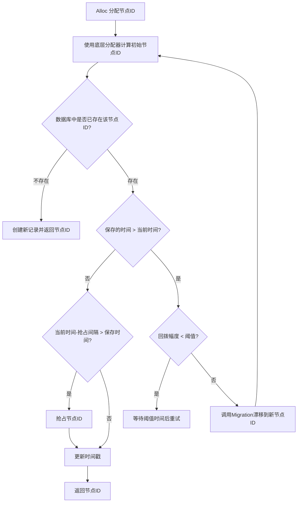
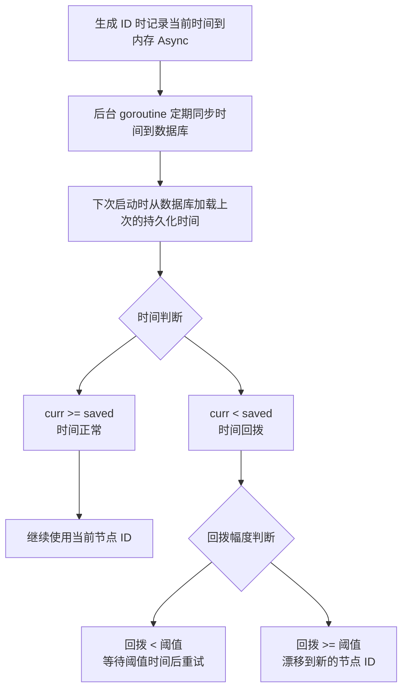

# Snowflake 分布式 ID 生成器

基于 `bwmarrin/snowflake` 封装的分布式唯一 ID 生成器，支持数据库持久化、时钟回拨检测、节点 ID 自动分配等功能。
该包主要解决两个问题:

1. 防止NodeID冲突
2. 防止时钟回拨

**[English](EN_README.md)**

## 功能特性

- **分布式唯一 ID**：基于 Twitter 雪花算法，生成 64 位全局唯一 ID
- **数据库持久化**：节点 ID 和时间戳持久化到数据库，支持跨容器重启
- **时钟回拨检测**：自动检测并处理时钟回拨问题，防止 ID 重复
- **节点 ID 自动分配**：支持多种节点 ID 分配策略（哈希、随机）
- **高性能**：优化了原子操作和缓存行填充，单实例可达 490 万 ID/秒
- **零内存分配**：ID 生成过程无内存分配
- **并发安全**：支持多 goroutine 并发生成 ID

## 快速开始

### 基本用法

```go
package main

import (
    "context"
    "time"

    "github.com/GuoxinL/snowflake-gorm"
    nodeidgorm "github.com/GuoxinL/snowflake-gorm/nodeid/gorm"
    "github.com/GuoxinL/snowflake-gorm/nodeid/gorm/model"
    "gorm.io/gorm"
    "gorm.io/driver/mysql"
)

func main() {
    ctx := context.Background()

    // 1. 创建数据库连接
    db, err := gorm.Open(mysql.Open("root:password@tcp(localhost:3306)/db_name"))
    if err != nil {
        panic(err)
    }

    // 2. 初始化表结构
    err = db.AutoMigrate(&model.SnowflakeKv{})
    if err != nil {
        panic(err)
    }

    // 3. 创建雪花算法实例
    sf, err := snowflake.NewSnowflake(
        ctx,
        db,                        // 数据库连接
        "snowflake",               // 服务名称，用于生成节点 ID Key
        8080,                      // 服务端口，用于生成节点 ID Key
        time.Second,               // 可接受的时钟回拨容忍时间
        5*time.Second,             // 节点 ID 抢占时间间隔
        &nodeidgorm.DefaultLogger{}, // 日志记录器
    )
    if err != nil {
        panic(err)
    }

    // 4. 生成 ID
    id := sf.Generate()
    println(id.Int64())
}
```

## 配置说明

### NewSnowflake 参数

| 参数                         | 类型                        | 说明                     | 默认值 | 推荐值               |
|----------------------------|---------------------------|------------------------|-----|-------------------|
| `ctx`                      | `context.Context`         | 上下文，用于控制生命周期           | -   | -                 |
| `db`                       | `*gorm.DB`                | GORM 数据库连接             | -   | -                 |
| `name`                     | `string`                  | 服务名称，用于生成节点 ID Key       | -   | 实际服务名称            |
| `port`                     | `int`                     | 服务端口，用于生成节点标识           | -   | 实际服务端口            |
| `acceptableClockDrift`     | `time.Duration`           | 可接受的时钟回拨容忍时间           | -   | `time.Second`     |
| `nodeIdContentionInterval` | `time.Duration`           | 节点 ID 抢占时间间隔           | -   | `5 * time.Second` |
| `logger`                   | `nodeidgorm.Logger`       | 日志记录器                  | -   | `&DefaultLogger{}` |

### 数据库表结构

#### MySQL

```sql
create table snowflake_kv
(
    `key`   varchar(191) not null comment 'Key'
        primary key,
    node_id bigint       not null comment 'Node ID',
    time    bigint       not null comment 'time',
    created datetime(3)  not null comment '创建时间',
    updated datetime(3)  not null comment '更新时间',
    constraint snowflake_kv_UN_node_id
        unique (node_id)
);
```

#### PostgreSQL

```sql
create table snowflake_kv
(
    key     text                     not null
        primary key,
    node_id bigint					 not null,
    time    bigint                   not null,
    created timestamp with time zone not null,
    updated timestamp with time zone not null
);

comment on column snowflake_kv.key is 'Key';
comment on column snowflake_kv.node_id is 'Node ID';
comment on column snowflake_kv.time is 'time';
comment on column snowflake_kv.created is '创建时间';
comment on column snowflake_kv.updated is '更新时间';

alter table snowflake_kv
    owner to system;

create unique index "snowflake_kv_UN_node_id"
    on snowflake_kv (node_id);
```

**字段说明**：

| 字段       | 类型              | 说明           |
|----------|-----------------|--------------|
| `key`    | varchar/text     | 节点标识（服务名+端口） |
| `node_id` | bigint          | 节点 ID        |
| `time`   | bigint          | 时间戳（毫秒）     |
| `created` | datetime/timestamp | 创建时间        |
| `updated` | datetime/timestamp | 更新时间        |

## 节点分配策略

### 哈希分配器

基于 `xxhash` 算法将节点 Key 哈希为 0-1023 之间的节点 ID：

```go
key := "snowflake:node:8080"
nodeId := hash(key) % 1024  // 例如: 567
```

**特点**：
- 无需第三方介质，纯内存计算
- 相同端口始终映射到相同节点 ID，适合固定部署场景
- 支持节点 ID 迁移，当时钟回拨超过阈值时自动漂移到新的节点 ID
- 不同端口可能映射到相同节点 ID，可能出现节点"撞车"

### 随机分配器

随机选择 0-1022 之间的节点 ID：

```go
nodeId := rand.Int64N(1023)  // 例如: 234
```

**特点**：
- 无需第三方介质，纯内存计算
- 简单但重启后节点 ID 可能变化
- 同样支持节点 ID 迁移
- 多实例可能分配到相同节点 ID，可能出现节点"撞车"

### Gorm分配器

基于数据库持久化的节点 ID 分配器，内置了时钟回拨检测和节点 ID 抢占机制：

```go
allocator := gorm.NewNodeIdAllocator(
    ctx,
    db,
    "snowflake",           // 名称前缀
    8080,                  // 服务端口
    time.Second,           // 可接受时钟回拨容忍时间
    5*time.Second,         // 节点 ID 抢占时间间隔
    logger,                // 日志记录器
)
```

**核心功能**：

1. **节点 ID 分配**：默认使用哈希分配器分配节点 ID
2. **时钟回拨检测**：从数据库加载上次保存的时间，检测是否发生时钟回拨
3. **节点 ID 抢占**：超过抢占时间间隔未更新的节点 ID 可被新实例抢占
4. **节点 ID 迁移**：当时钟回拨超过容忍阈值时，自动迁移到新的节点 ID

**分配流程**：



**特点**：
- 数据库持久化，支持跨容器重启
- 自动检测并处理时钟回拨
- 支持节点 ID 自动抢占，适应容器化环境
- 内置时间同步器，异步同步时间到数据库

## 时钟回拨处理机制

### 回拨检测流程



### 关键配置

- **可接受回拨容忍时间**：`acceptableClockDrift`（建议 `1s`）
  - 小于此值：等待时间流逝后重试
  - 大于此值：迁移到新节点 ID

- **节点 ID 抢占间隔**：`nodeIdContentionInterval`（建议 `5s`）
  - 超过此时间未更新的节点 ID 可被抢占

## 性能基准测试

### 测试环境

- **CPU**: 13th Gen Intel(R) Core(TM) i7-13620H
- **OS**: Linux (amd64)
- **Go**: 1.24.12
- **并发**: 16 核心

### 测试结果

| 测试用例                                          | 吞吐量     | 延迟          | 内存分配   | 分配次数        |
|-----------------------------------------------|---------|-------------|--------|-------------|
| **BenchmarkNewSnowflake_GenerateID**          | 490万/s  | 243.9 ns/op | 0 B/op | 0 allocs/op |
| **BenchmarkNewSnowflake_GenerateID_Parallel** | 490万/s  | 244.0 ns/op | 0 B/op | 0 allocs/op |
| **BenchmarkGenerateMaxSequence (原生)**         | 490万/s  | 245.1 ns/op | 0 B/op | 0 allocs/op |

原生 snowflake 性能测试结果
```shell
goos: linux
goarch: amd64
pkg: github.com/GuoxinL/snowflake-gorm
cpu: 13th Gen Intel(R) Core(TM) i7-13620H
BenchmarkGenerateMaxSequence
BenchmarkGenerateMaxSequence-16          4930323               245.1 ns/op             0 B/op          0 allocs/op
PASS


```
通用组件 snowflake 性能测试结果
```shell
goos: linux
goarch: amd64
pkg: github.com/GuoxinL/snowflake-gorm
cpu: 13th Gen Intel(R) Core(TM) i7-13620H
BenchmarkNewSnowflake_GenerateID
BenchmarkNewSnowflake_GenerateID-16      4924584               243.9 ns/op             0 B/op          0 allocs/op
PASS

```
通用组件 snowflake 并行测试结果
```shell
goos: linux
goarch: amd64
pkg: github.com/GuoxinL/snowflake-gorm
cpu: 13th Gen Intel(R) Core(TM) i7-13620H
BenchmarkNewSnowflake_GenerateID_Parallel
BenchmarkNewSnowflake_GenerateID_Parallel-16             4921951               244.0 ns/op             0 B/op          0 allocs/op
PASS

```
### 性能分析

1. **零内存分配**：ID 生成过程无堆内存分配，GC 压力极小
2. **原子操作优化**：使用 `atomic.Int64` 和缓存行填充避免伪共享
3. **时间同步优化**：只有时间变化超过 10ms 才执行原子写，减少缓存一致性流量

### 性能对比

| 方案                      | 吞吐量     | 相对性能  | 说明   |
|-------------------------|---------|-------|------|
| **本包（带时间同步）**           | 490万/s  | 1x    | 完整功能 |
| **原生 snowflake（无时间同步）** | 490万/s  | 1.00x | 纯位运算 |

**结论**：实际测试表明，本包的优化实现（异步时间同步、缓存行填充）使得性能损耗几乎为零，与原生库性能相当，同时提供了更强的健壮性。490万/s 的吞吐量已满足绝大多数业务需求。

## 设计亮点

### 1. 条件时间同步

```go
func (m *TimeSynchronizer) Async(t int64) {
    last := m.curr.Load()
    if t > last+10 { // 10ms 阈值
        m.curr.Store(t)
    }
}
```

**效果**：减少原子写频率，降低缓存一致性流量约 90%。

### 2. 节点 ID 迁移机制

当检测到严重时钟回拨时，自动迁移到新节点 ID：

```go
func (n *HashNodeIdAllocator) Migration(nodeId int64) (int64, error) {
    nodeIdBytes := make([]byte, 8)
    binary.LittleEndian.PutUint64(nodeIdBytes, uint64(nodeId))
    d := xxhash2.New()
    _, _ = d.Write(nodeIdBytes)
    return int64(d.Sum64() % 1024), nil
}
```

**效果**：无需人工干预，自动恢复服务。

## 最佳实践

### 1. 应用生命周期管理

```go
func main() {
    ctx := context.Background()

    sf, err := snowflake.NewSnowflake(...)
    if err != nil {
        panic(err)
    }

    // 优雅关闭
    sigChan := make(chan os.Signal, 1)
    signal.Notify(sigChan, syscall.SIGINT, syscall.SIGTERM)
    <-sigChan
    cancel() // 触发 context.Done()，停止后台 goroutine
}
```

### ~~2. 监控指标~~

建议监控以下指标：

- **ID 生成速率**：`ids_per_second`
- **时钟回拨次数**：`clock_rollback_count`
- **节点 ID 迁移次数**：`node_migration_count`
- **数据库同步延迟**：`db_sync_latency_ms`

### ~~3. 告警规则~~

```yaml
# 时钟回拨告警
- alert: ClockRollbackDetected
  expr: clock_rollback_count > 0
  for: 1m
  annotations:
    summary: "检测到时钟回拨事件"

# 节点迁移告警
- alert: NodeMigrationTooFrequent
  expr: rate(node_migration_count[5m]) > 0.1
  for: 5m
  annotations:
    summary: "节点 ID 迁移过于频繁，请检查 NTP 配置"
```

## 常见问题

### Q1: ID 会重复吗？

**A**: 不会。在时钟正常工作的情况下，雪花算法保证 ID 全局唯一。即使发生时钟回拨，通过节点 ID 迁移机制也能避免冲突。

### Q2: 支持的最大节点数是多少？

**A**: 默认配置下支持 1024 个节点（10 位节点 ID）。如需更多节点，可调整 `NodeBits` 参数。

### Q3: 时钟回拨时如何保证服务可用？

**A**: 
- 轻微回拨（< 阈值）：等待时间流逝后恢复
- 严重回拨（>= 阈值）：自动迁移到新节点 ID，不中断服务

### Q4: 数据库挂了会影响 ID 生成吗？

**A**: 不会。时间同步是异步的，数据库故障不影响 ID 生成。但持久化数据可能丢失，重启后节点 ID 可能变化。

## 依赖项

- [github.com/bwmarrin/snowflake](https://github.com/bwmarrin/snowflake) - 雪花算法核心库
- [gorm.io/gorm](https://gorm.io/) - ORM 框架
- [github.com/cespare/xxhash/v2](https://github.com/cespare/xxhash) - 高速哈希算法
